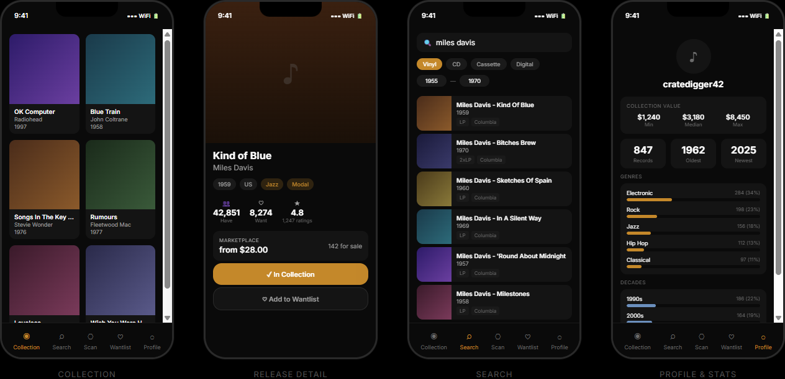

# Wax

A premium third-party [Discogs](https://www.discogs.com/) client for iOS and Android. Built with Expo and React Native.

Wax connects to your existing Discogs account and gives you a faster, more polished way to browse your collection, search the database, scan barcodes, and explore your listening stats — all with a dark-mode-first design and local SQLite caching.

## Features

- **Collection browser** — 2-column grid with cover art, pull-to-refresh, infinite scroll, and background sync
- **Sorting** — Sort collection and wantlist by date added, artist, title, or year
- **Search** — Debounced search with format and year filters, infinite pagination via Discogs API
- **Barcode scanner** — Point your camera at a record's barcode for instant lookup
- **Wantlist** — Browse and manage your Discogs wantlist with the same grid layout
- **Release detail** — Hero cover art, tracklist, labels, community stats, marketplace pricing, add/remove from collection and wantlist
- **Rating editor** — Rate releases 1–5 stars directly in the app (syncs to Discogs)
- **Sharing** — Share any release via the native share sheet
- **Profile & stats** — Genre breakdown, decade distribution, top labels, format split, collection growth chart, and collection value
- **Dark / Light / System theme** — Fully themed UI with instant toggle
- **Offline support** — SQLite-cached collection data with offline detection banner
- **Skeleton loading** — Shimmer placeholders with reanimated opacity pulse
- **Haptic feedback** — Tactile responses on key interactions (iOS/Android)
- **Toast notifications** — Animated slide-down error/success toasts

## Why Wax?

Most Discogs apps are either basic web wrappers or read-only viewers. Wax is a fully native client that goes further:

| | Wax | Official Discogs App | Other 3rd-party Apps |
|---|:---:|:---:|:---:|
| Collection grid with cover art | **Yes** | List only | Varies |
| Sort by artist / title / year | **4 options** | Date only | 1–2 options |
| Barcode scanner | **Instant** | Slow | Sometimes |
| Wantlist management | **Full** | Web only | Rare |
| Rate releases in-app | **Yes** | Web only | No |
| Stats dashboard | **6 charts** | No | Basic at best |
| Collection value | **Min / Med / Max** | Web only | Rare |
| Share releases | **Native sheet** | No | Rare |
| Dark + Light theme | **Both + System** | Light only | Usually one |
| Offline mode | **SQLite cache** | No | No |
| Marketplace prices | **Per release** | Web only | Some |
| Background sync | **Incremental** | No cache | No |
| Haptic feedback | **Yes** | No | No |
| Smart rate limiting | **Priority queue** | Internal | Rarely |

> Wax is what the official Discogs app should be.

## Screenshots

<p align="center">
  
</p>

## Tech Stack

| Layer | Technology |
|-------|-----------|
| Framework | [Expo SDK 54](https://expo.dev/) (React Native 0.81) |
| Navigation | [expo-router 6](https://docs.expo.dev/router/introduction/) (file-based) |
| State | [Zustand 5](https://github.com/pmndrs/zustand) |
| Data fetching | [TanStack Query 5](https://tanstack.com/query) |
| Local database | [expo-sqlite 16](https://docs.expo.dev/versions/latest/sdk/sqlite/) |
| Styling | [NativeWind 4](https://www.nativewind.dev/) (Tailwind CSS for React Native) |
| Images | [expo-image](https://docs.expo.dev/versions/latest/sdk/image/) with blurhash placeholders |
| Animations | [react-native-reanimated 4](https://docs.swmansion.com/react-native-reanimated/) |
| Camera | [expo-camera](https://docs.expo.dev/versions/latest/sdk/camera/) |
| Auth storage | [expo-secure-store](https://docs.expo.dev/versions/latest/sdk/securestore/) |

## Architecture

```
UI Layer          React components + Zustand (UI state)
                          ↕
Data Access       TanStack Query (remote) + SQLite (persistent cache)
                          ↕
API Layer         Discogs client with OAuth 1.0a + rate limiter (60 req/min)
```

**No custom backend** — all data comes directly from the Discogs API. Collection and wantlist data is synced to SQLite for offline access and local stats computation.

### Key architectural decisions

- **Hybrid sync** — show first page from SQLite immediately, background-sync the rest, incremental on reopen
- **Rate limiter** — token bucket with 3-level priority queue (user interactions > prefetch > background sync)
- **Local stats** — genre/decade/label/format breakdowns computed from 8 parallel SQL queries
- **OAuth 1.0a PLAINTEXT** — simpler than HMAC-SHA1, sufficient for mobile OAuth flows
- **ToS compliance** — cached data max 6 hours stale, prices never persisted, Discogs attribution included

## Project Structure

```
wax/
├── app/
│   ├── _layout.tsx              # Root layout with auth gate, providers, toast/offline banner
│   ├── +not-found.tsx
│   ├── login.tsx                # OAuth login screen
│   ├── release/[id].tsx         # Release detail (shared across all tabs)
│   └── (tabs)/
│       ├── _layout.tsx          # 5-tab bottom navigation
│       ├── collection/          # Collection grid + sync
│       ├── search/              # Search with filters
│       ├── scan/                # Barcode scanner
│       ├── wantlist/            # Wantlist grid
│       └── profile/             # Stats dashboard + settings
├── components/
│   ├── release-card.tsx         # Grid card with cover art
│   ├── empty-state.tsx          # Reusable empty/error state
│   ├── skeleton.tsx             # Shimmer loading skeletons
│   ├── sync-progress-bar.tsx    # Animated sync progress
│   ├── toast.tsx                # Slide-down toast notifications
│   └── offline-banner.tsx       # Offline detection banner
├── lib/
│   ├── api/
│   │   ├── client.ts            # OAuth-signed fetch with error handling
│   │   ├── endpoints.ts         # 15 typed Discogs API methods
│   │   └── rate-limiter.ts      # Token bucket + priority queue
│   ├── db/
│   │   ├── schema.ts            # 5 tables, 5 indexes
│   │   └── queries.ts           # 19 typed query functions
│   ├── sync/
│   │   ├── collection-sync.ts   # Full + incremental collection sync
│   │   └── wantlist-sync.ts     # Wantlist sync engine
│   ├── store/
│   │   ├── auth-store.ts        # OAuth tokens + username
│   │   ├── sync-store.ts        # Sync status + progress
│   │   ├── ui-store.ts          # View mode, theme prefs
│   │   ├── toast-store.ts       # Toast message queue
│   │   └── network-store.ts     # Online/offline tracking
│   ├── stats.ts                 # 8 parallel stat queries
│   └── haptics.ts               # 3-tier haptic feedback
└── docs/plans/
    ├── 2026-02-25-wax-v1-design.md
    └── 2026-02-25-wax-v1-implementation.md
```

## Getting Started

### Prerequisites

- [Node.js](https://nodejs.org/) 18+
- [Expo CLI](https://docs.expo.dev/get-started/installation/)
- A [Discogs](https://www.discogs.com/) account
- Discogs API consumer key and secret ([register here](https://www.discogs.com/settings/developers))

### Setup

```bash
# Clone the repo
git clone https://github.com/kevjaeg/CrateDigger.git
cd CrateDigger/wax

# Install dependencies
npm install

# Add your Discogs API credentials
cp .env.example .env
# Edit .env and add your EXPO_PUBLIC_DISCOGS_KEY and EXPO_PUBLIC_DISCOGS_SECRET

# Start the dev server
npx expo start
```

Scan the QR code with [Expo Go](https://expo.dev/go) or press `i` for iOS simulator / `a` for Android emulator.

## Privacy Policy

[Read the full privacy policy](https://kevjaeg.github.io/CrateDigger/privacy-policy.html)

Wax does not collect analytics, use trackers, or send data to any server other than the Discogs API. All collection data is cached locally on your device.

## Discogs API Compliance

This app follows the [Discogs API Terms of Service](https://www.discogs.com/developers/):

- Cached data is refreshed within 6 hours
- Marketplace prices are never persisted locally
- All data is attributed to Discogs
- Rate limiting respects the 60 authenticated requests/minute limit
- Commercial use requires written permission from Discogs

## License

This project is not yet licensed. All rights reserved.

---

Built with data from [Discogs](https://www.discogs.com/).
